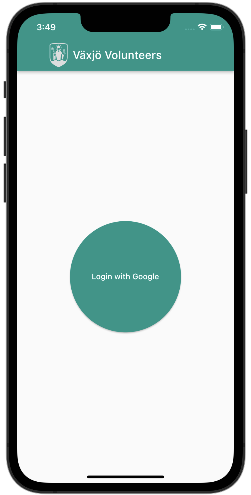
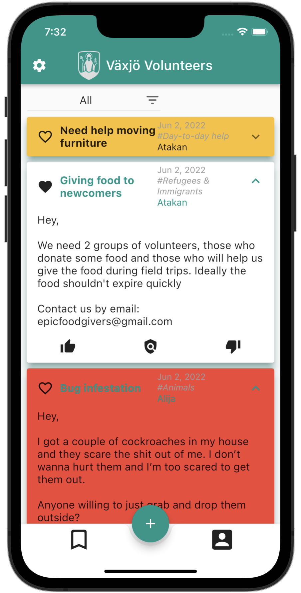
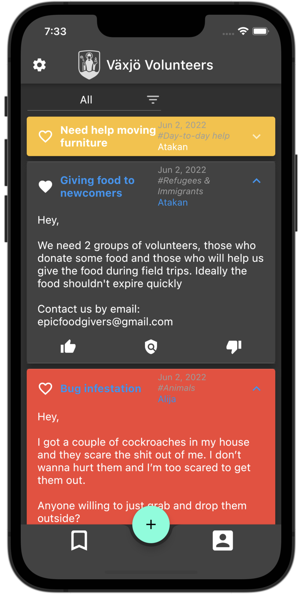
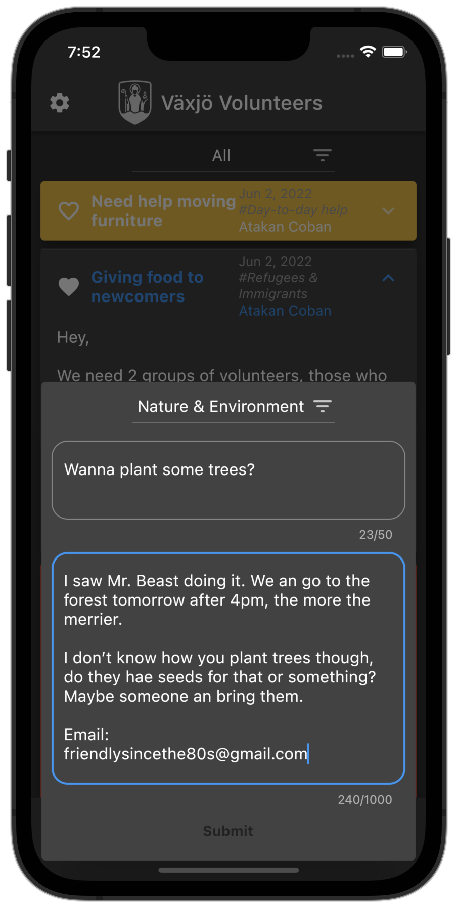
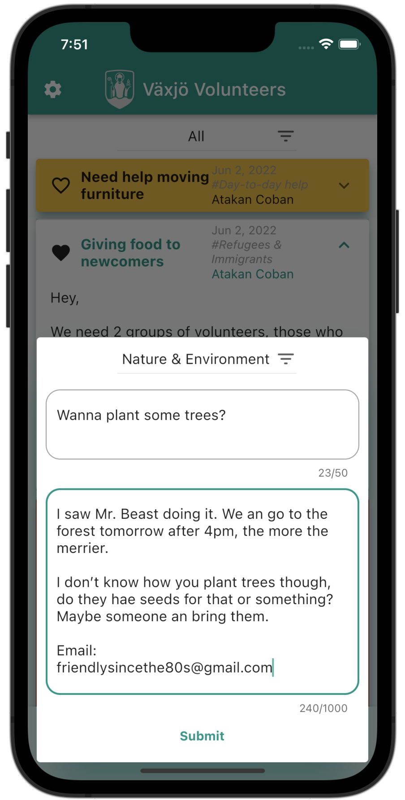
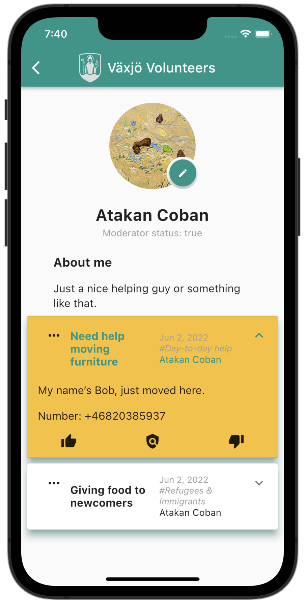
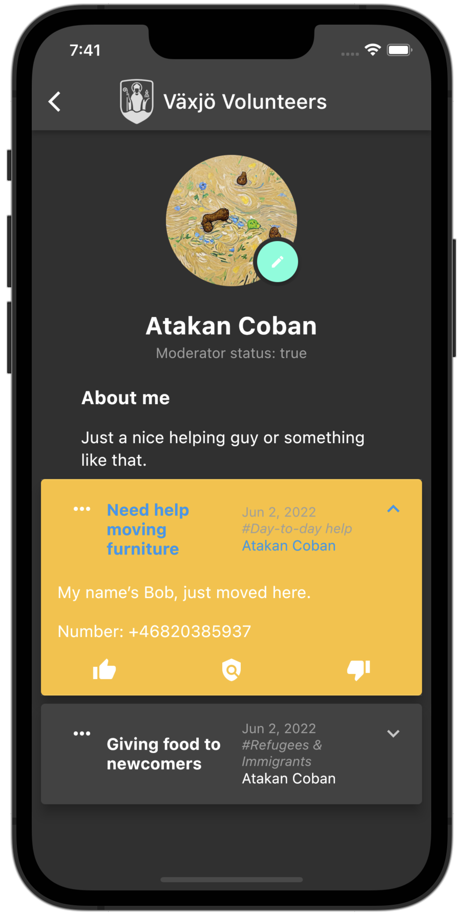

    <h1> Vaxjo Volunteers Mobile App </h1>
    

        
         
        <h2> Request or attend local volunteering events easily </h2>
        
        
         
        <h2> Designed for iOS and Android with Flutter </h2>
        
        
         
        <h2> Using PostgreSQL database </h2>
        
        
    
 

## Introduction
Vaxjo Volunteers, a multi-platform mobile platform to match volunteers with those who request help. The application was built using: 
* Flutter SDK
* Client-server and MVVM architecture on the client side of the system.
* Javalin lightweight REST API web framework
* PostgreSQL DBMS  for the persistence layer of the system

## Process
This is a project I worked on in a group of 5 people in order to learn software engineering. That means that we actually spent most of our time actually making the design document for architecture, abstractions, etc... and requirements document for functionality, UI and more. [These docs can be found in this repository.](docs/)

After the engineering process, we had about 3 weeks to both learn how to use Flutter from scratch and actually implement it.

## Criticism
Being that we were on a deadline and the main purpose of this experience was to learn, there are some notable issues with the apps current state.

### Deployment
The app is not properly released at the moment. It's not available in mobile app stores. Also, the front-end and back-end are separated and have to be (slightly annoyingly) setup as such. Luckily there is a well documented README for both ends if you'd like to run the app for yourself.

### Mocks
There is no global server at the moment. Instead, the user must host a local database on their device and use that while pretending to interact with others.

## Bright light
Although the app is not ready for a v1 release, it's not that far from being so. If the team is interested in furthering its vision, it can be ready for release with some touchups.

## Credits
* Atakan Coban
* Alija Levic
* Kateryna Melnyk
* Richard Oelschlager
* Albert Henmyr