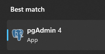
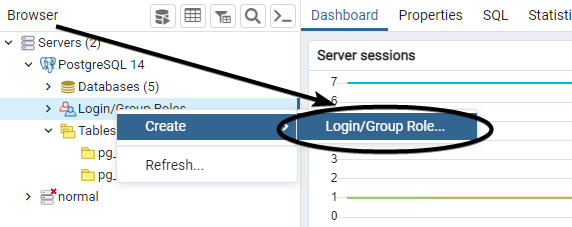
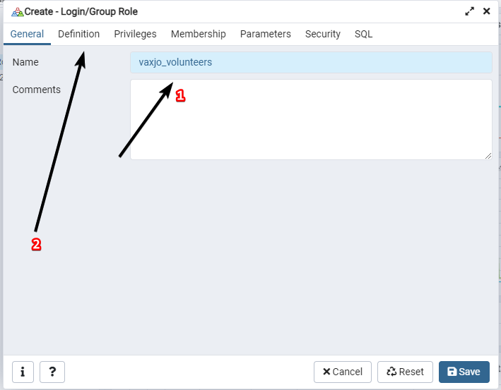
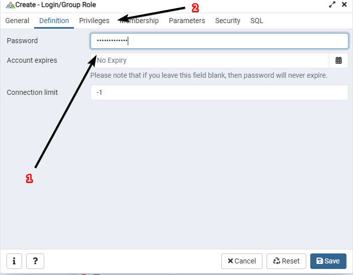
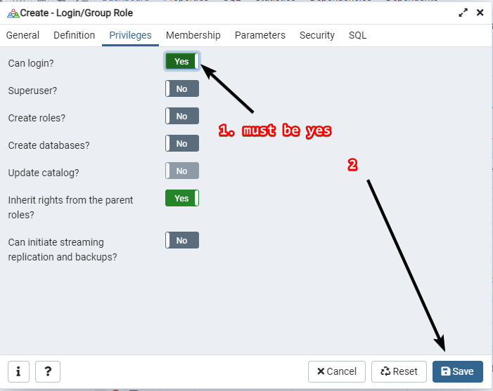
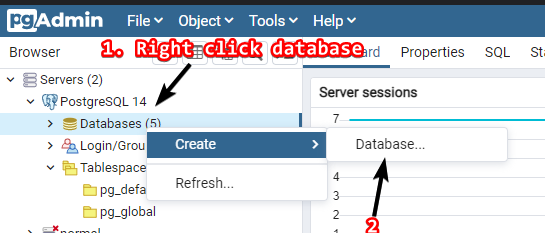
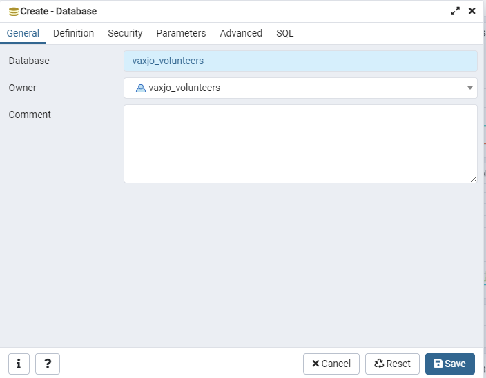
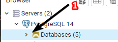
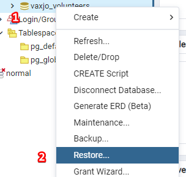
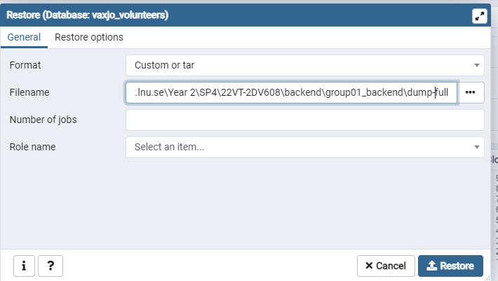

# Readme of the backend

# Note
For Flutter to work you need to have backend ready, following this readme will set up your backend.\
The IP of the backend will be used in Flutter to connect the client to the server.

<em>$project_dir</em> refers to the extracted backend source code zip file. backend.zip

# Prerequisites
In no specific order, these instructions are tested under Windows, as there is other platform support. 
1. [Java 17 JDK](https://www.oracle.com/java/technologies/downloads/#java17) - Used to run the application.
2. [PostgresSQL Server](https://www.postgresql.org/download/) - Used as database.
3. [Jetbrains IDEA](https://www.jetbrains.com/idea/download/) - Used to run the application; any other IDE works but 
   instructions won't be covered.

## Before compiling
Install PostgresSQL server with default configuration, pick JDBC driver and make sure pgAdmin is included.\
The JDBC driver is used to connect the application to the database.\
Take note of the password you used, it will be used later extensively.

### PostgreSQL post installation setup

#### Creating user and database
We have to launch pgAdmin, which was installed with PostgreSQL.\


After launching, you will be presented with a login screen.\
Enter the password you created during PostgresSQL installation.

First you will create a user. In the tutorial below we will go with the default insecure credentials, on a real 
deployment these would be different and read from a configuration file.

1. Start by right clicking on <em>Login/Group roles</em> and then pressing <em>Login/Group Role...</em>, see screenshot.


2. Now name the database we will create. In our example we will use vaxjo_volunteers, but this can be anything. Click 
   on <em>Definition</em>.


3. Now proceed to enter a password of your choosing. In our example we will use "vaxjo_volunteers", but this can 
   also be anything.\
Click on <em>privileges</em>.


4. Now change <em>Can login?</em> so the user can log in, then press <em>Save</em> to save. 


5. If you changed the default credentials follow the steps below, otherwise skip to next section.
- Change the credentials in /src/main/java/se.lnu.vaxjovolunteers/SettingsTemporarily.java


## Database import
We will create a database named vaxjo_volunteers with the user vaxjo_volunteers and password vaxjo_volunteers. 

1. Go back to pgAdmin 4.
2. Right click on databases and press Create -> Database.

3. Create a new database named vaxjo_volunteers and set the owner to the user you created in previous step.\
For us this is vaxjo_volunteers.

4. Expand the database list. \

5. Now right click on the vaxjo_volunteers or the name you gave it and press Restore.\

6. Make sure the format is set to "Custom or tar" and that you specify the "dump-full" from the $project_dir. 

\
   If you changed the default credentials follow the below steps, otherwise skip to next section.

Change the credentials in /src/main/java/se.lnu.vaxjovolunteers/SettingsTemporarily.java
Now you can close pgadmin. 

## Compiling
Before building, we must change code generation database credentials, see below. 

### Changing code generation credentials 
Before building, you must change the JOOQ database credentials; these are defined in build.gradle under jooq section.

```
jdbc.apply {
    driver = "org.postgresql.Driver"
    url = "jdbc:postgresql://localhost:5432/vaxjo_volunteers"
    user = "vaxjo_volunteers"
    password = "vaxjo_volunteers"
}
```

Specifically this section must be populated with your credentials. 
In a production environment this would be read from environment files.

### Gradle
Now we have to compile the application. Open the project in IDEA, and run build from Gradle tasks.
You can also run <em>gradlew build</em> from the terminal.

Building may take some time.

### Running application

For development purposes:
You can run the application by going into the Main class and pressing Run on the main function there.

For production purposes: 

You can run the java file directly going into $project_dir/build/libs/ and then opening a terminal there.
`java -jar group01_backend-1.0-SNAPSHOT-all.jar`

### Getting IP for Flutter
For Flutter to connect you have to follow our Flutter guide and use the IP this backend runs on as the IP from Flutter.

If our local IP is 192.168.1.4 then the IP that has to be put in Flutter would be 
192.168.1.4:7070. 7070 is the default port, and can be changed in $project_dir/src/main/java/se.lnu.vaxjovolunteers/SettingsTemporarily.java

# Usage
The application itself has no usage; Flutter simply connects to it. 

You can test it's running by going on http://localhost:7070/; if you are testing from another computer you will 
replace localhost as appropriate.\
It should greet you with "Hello World".